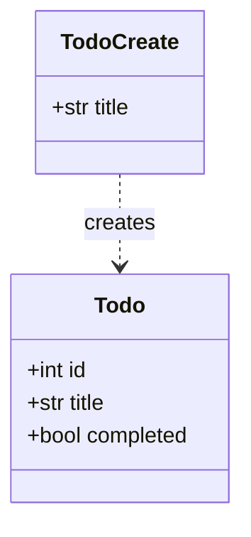

# API ドキュメント生成（generate-docs）

FastAPI のソースコードから API ドキュメントを生成し、`docs/API.md` に Markdown で保存する。

## 使うタイミング

- コードの実装内容から最新の API ドキュメントを起こしたい / 更新したいとき
- エンドポイント・データモデル・セットアップ手順をまとめた `docs/API.md` を作りたいとき

## 手順

1. **対象コードを読む**
   - 引数でファイルが指定されていればそれを、なければ [main.py](../../../main.py) を読む。
   - 依存関係は [requirements.txt](../../../requirements.txt)、既存のセットアップ手順は [README.md](../../../README.md) を参照する（重複記述はここから要約する）。

2. **エンドポイントを抽出する**
   - `@app.get` / `@app.post` / `@app.put` / `@app.delete` などのデコレータとハンドラ関数を走査する。
   - 各エンドポイントについて次を収集: HTTP メソッド、パス、概要、パスパラメータ、リクエストボディ（Pydantic モデル）、レスポンス（`response_model` とステータスコード）。
   - **コメントアウトされている / 未実装のエンドポイントは「未実装」と明記する**（このプロジェクトでは `GET /todos/{todo_id}` がハンズオン用に未実装のことがある）。実装済みとして書かない。

3. **データモデルを抽出する**
   - `BaseModel` を継承したクラスを走査し、各フィールドの名前・型・デフォルト値をまとめる。

4. **Mermaid クラス図を作る**
   - 抽出したモデルを ```mermaid の `classDiagram` で表現する。フィールドと型を記載し、関連（例: 作成入力→エンティティ）があれば矢印で示す。

5. **`docs/API.md` を生成する**
   - 下記テンプレートに沿って Markdown を組み立て、`docs/API.md` に保存する（`docs/` が無ければ作成）。
   - 既存の `docs/API.md` がある場合は上書き更新する。

6. **検証する**
   - Markdown の見出し階層・表・コードフェンス・Mermaid ブロックが壊れていないか確認する。
   - エンドポイント数・モデル数がソースと一致しているか目視で確認する。

## 出力テンプレート（docs/API.md）

````markdown
# API リファレンス

<!-- このファイルは generate-docs スキルで自動生成。手動編集は次回生成で上書きされます。 -->

## 概要

<プロジェクトの 1〜2 行の説明>

## セットアップ

```bash
python3 -m venv .venv
# Windows (PowerShell)
.venv\Scripts\Activate.ps1
pip install -r requirements.txt
```

### 起動

```bash
uvicorn main:app --reload
```

- Swagger UI: http://127.0.0.1:8000/docs

## エンドポイント一覧

| メソッド | パス | 説明 | ステータス |
|---|---|---|---|
| GET | `/` | ... | 200 |

### `POST /todos`

新しい TODO を作成する。

**リクエスト**

```json
{ "title": "New task" }
```

**レスポンス (201)**

```json
{ "id": 4, "title": "New task", "completed": false }
```

<!-- 未実装のエンドポイントは次のように明記する -->
### `GET /todos/{todo_id}` （未実装）

ハンズオンで実装予定。指定 id の TODO を返し、無ければ 404。

## データモデル

### `Todo`

| フィールド | 型 | デフォルト |
|---|---|---|
| id | int | （必須） |
| title | str | （必須） |
| completed | bool | `False` |

## クラス図


````

## 規約

- 出力は日本語の Markdown。
- 実際のコードに存在しない挙動を推測で書かない。未実装は必ず「未実装」と明示する。
- レスポンス例の JSON はデータモデルのフィールド・型・デフォルト値と整合させる。
