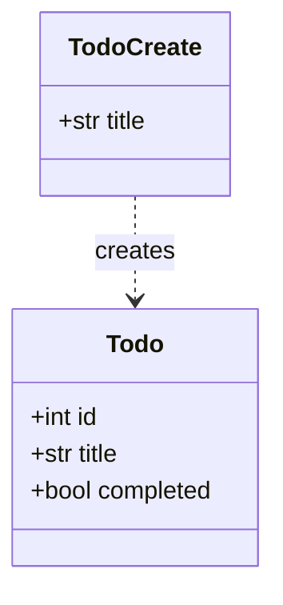

# API リファレンス

<!-- このファイルは generate-docs スキルで自動生成。手動編集は次回生成で上書きされます。 -->

## 概要

FastAPI で作成したシンプルな TODO 管理 API。データは DB を使わずインメモリの `list` で管理する（プロセス再起動で初期 3 件に戻る）。

## セットアップ

```bash
python3 -m venv .venv
# Windows (PowerShell)
.venv\Scripts\Activate.ps1
pip install -r requirements.txt
```

### 起動

```bash
uvicorn main:app --reload
```

- API ルート: http://127.0.0.1:8000/
- Swagger UI: http://127.0.0.1:8000/docs

## エンドポイント一覧

| メソッド | パス | 説明 | ステータス |
|---|---|---|---|
| GET | `/` | ウェルカムメッセージを返す | 200 |
| GET | `/todos` | TODO 一覧を返す | 200 |
| POST | `/todos` | 新しい TODO を作成する | 201 |
| GET | `/todos/{todo_id}` | 指定 id の TODO を取得する | 200 / 404 |

### `GET /`

ウェルカムメッセージを返す。

**レスポンス (200)**

```json
{ "message": "Welcome to the TODO App!" }
```

### `GET /todos`

すべての TODO を一覧で返す。

**レスポンス (200)**

```json
[
  { "id": 1, "title": "Buy groceries", "completed": false },
  { "id": 2, "title": "Read a book", "completed": true },
  { "id": 3, "title": "Write report", "completed": false }
]
```

### `POST /todos`

新しい TODO を作成する。ID は既存の最大 ID + 1、`completed` は常に `false` で作成される。

**リクエスト**

```json
{ "title": "New task" }
```

**レスポンス (201)**

```json
{ "id": 4, "title": "New task", "completed": false }
```

### `GET /todos/{todo_id}`

指定した id の TODO を返す。見つからない場合は 404 を返す。

**パスパラメータ**

| 名前 | 型 | 説明 |
|---|---|---|
| todo_id | int | 取得する TODO の id |

**レスポンス (200)**

```json
{ "id": 1, "title": "Buy groceries", "completed": false }
```

**レスポンス (404)**

```json
{ "detail": "Todo not found" }
```

## データモデル

### `TodoCreate`

TODO 作成時のリクエストボディ。

| フィールド | 型 | デフォルト |
|---|---|---|
| title | str | （必須） |

### `Todo`

TODO エンティティ（レスポンス）。

| フィールド | 型 | デフォルト |
|---|---|---|
| id | int | （必須） |
| title | str | （必須） |
| completed | bool | `False` |

## クラス図


